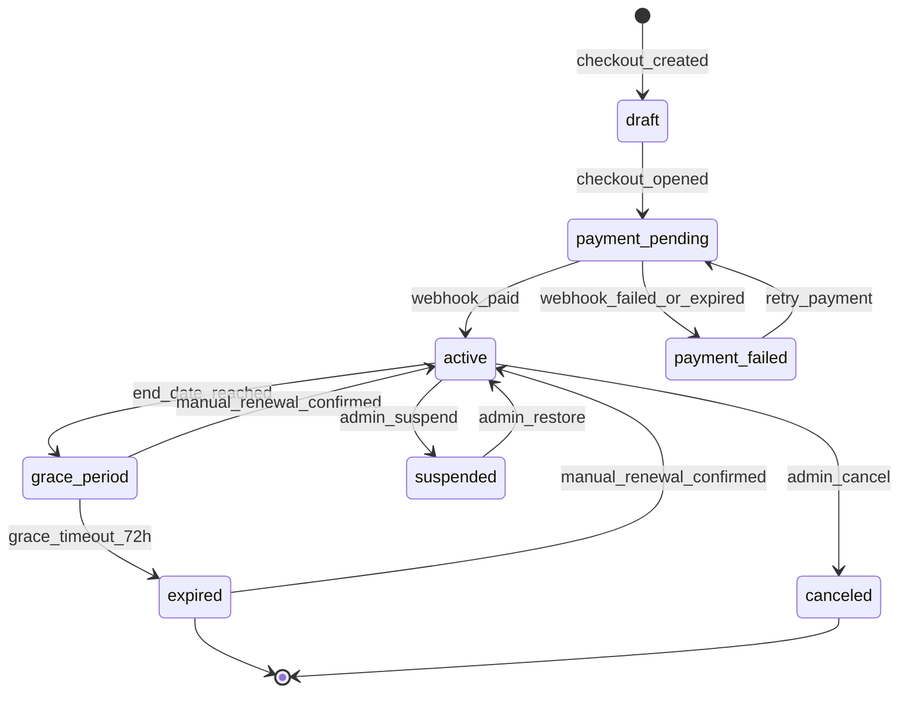

# 01. Product, JTBD, CJM, KPI

## 1) Product north star (MVP)

**Продукт:** платный Йога-Клуб с доступом через личный кабинет: Zoom-эфиры, записи (Kinescope), статьи, статус подписки.  
**Цель MVP:** стабильно конвертировать трафик в оплаченных подписчиков и удерживать активную базу за счет ручного продления.

## 2) JTBD

### Functional jobs

- Когда у меня нет регулярной практики, я хочу получить понятный формат занятий и доступ к записям, чтобы заниматься стабильно.
- Когда я пропускаю эфир, я хочу быстро найти запись, чтобы не выпадать из процесса.
- Когда оплачиваю онлайн-клуб, я хочу сразу получить доступ, чтобы не ждать ручной обработки.
- Когда мне нужен контакт с преподавателем/сообществом, я хочу видеть прозрачный канал поддержки.

### Emotional jobs

- Чувствовать, что я "в клубе", а не купил разовый урок.
- Быть уверенным, что доступ не пропадет внезапно и понятны правила продления.
- Снизить тревогу по поводу безопасности практики (медицинский disclaimer + понятные правила).

### Social jobs

- Быть частью сообщества с похожими ценностями.
- Видеть социальное подтверждение (отзывы, история преподавателей, структурированная программа).

## 3) Сегменты аудитории (MVP)

1. **Новички (cold/warm трафик)**
   - Триггер: "хочу начать йогу дома безопасно".
   - Барьеры: страх травм, неуверенность в формате, недоверие к онлайн.
   - Что критично: понятный onboarding, FAQ, быстрый старт после оплаты.

2. **Практикующие с перерывами**
   - Триггер: "нужно вернуться в регулярность".
   - Барьеры: нехватка времени, нерегулярный график.
   - Что критично: запись эфиров, удобный доступ, годовой тариф как экономия.

3. **Текущая Telegram-аудитория**
   - Триггер: уже знают бренд и хотят больше структуры.
   - Барьеры: непонимание, зачем переходить в кабинет.
   - Что критично: бесшовный путь из Telegram в оплату и личный кабинет.

## 4) Роли и зона ответственности

- **student**
  - Регистрация/логин, оплата, просмотр статуса подписки.
  - Доступ к Zoom через backend redirect.
  - Доступ к видео и статьям при активной подписке.

- **admin**
  - Полный доступ к управлению продуктами, тарифами, подписками, пользователями.
  - Ручное продление/пауза подписки, просмотр audit/logs.

- **editor**
  - Управление контентом (статьи, карточки материалов, метаданные).
  - Без финансовых/доступных операций по подпискам.

- **support**
  - Просмотр профиля и статуса подписки пользователя.
  - Создание тикетов/заметок, чтение истории платежных статусов.
  - Без прав публикации контента и изменения тарифов.

## 5) CJM (as-is -> to-be MVP)

### Шаг 1. Осведомленность
- Вход: SEO, Telegram, прямые ссылки.
- Ожидание: "Понять, что такое Йога-Клуб и чем он полезен".
- MVP-артефакты: главная + страница клуба + social proof + FAQ.
- KPI шага: CTR в `/club`, глубина скролла, переход в тарифы.

### Шаг 2. Рассмотрение
- Вход: `/club`, `/club/rates`, `/how-to-buy`.
- Ожидание: "Понять стоимость, формат, правила доступа и возврата".
- MVP-артефакты: прозрачные тарифы, legal links, медицинский disclaimer.
- KPI шага: click-to-checkout rate.

### Шаг 3. Покупка
- Вход: checkout.
- Ожидание: "Оплатить без ошибок и получить доступ сразу".
- MVP-артефакты: checkout + webhook + success flow + идемпотентность.
- KPI шага: payment success rate, webhook success rate, TTV (time-to-value).

### Шаг 4. Активация
- Вход: `/payment/success` -> `/account`.
- Ожидание: "Сразу зайти в Zoom/записи/статьи".
- MVP-артефакты: dashboard, подписка, доступ к контенту по RBAC.
- KPI шага: доля пользователей, открывших хотя бы 1 видео/статью в первые 24 часа.

### Шаг 5. Удержание
- Вход: регулярное потребление контента.
- Ожидание: "Легко продолжать практику и продлевать доступ".
- MVP-артефакты: видимая дата окончания подписки, `grace period 72h`, CTA ручного продления, SLA поддержки до 2 часов (10:00-22:00 МСК).
- KPI шага: retention D30, renewal rate (manual), churn rate.

## 6) Воронка MVP (первый релиз)

1. `Landing/SEO` -> 2. `Club Page` -> 3. `Rates` -> 4. `Checkout started` -> 5. `Payment success` -> 6. `Account first login` -> 7. `First content consumption` -> 8. `Manual renewal`.

Ключевые коэффициенты:

- `Visit -> Checkout Start`
- `Checkout Start -> Payment Success`
- `Payment Success -> Account Activated (<= 5 минут)`
- `Activated -> First Value (первое видео/статья <= 24ч)`
- `Active -> Renewal`

## 7) KPI (операционные и продуктовые)

### Активация и выручка
- Payment success rate >= 92%.
- Webhook processing success (без ручного вмешательства) >= 99%.
- Median time from payment to active subscription <= 60 секунд.
- Conversion `Rates -> Paid` (базовый целевой ориентир MVP): >= 3-5%.

### Удержание
- D7 content engagement (>= 1 контент-событие): >= 60%.
- D30 renewal intent (клик на продление / коммуникация в поддержку): >= 35%.
- Churn по окончанию периода: отслеживать как baseline с релиза.

### Качество сервиса
- Доля 5xx по критичным API (`checkout`, `webhook`, `videos auth`, `zoom redirect`) < 1%.
- Доля access-denied ошибок у активных подписок < 0.5%.
- Время ответа `videos auth` и `zoom redirect` p95 < 400 мс.

## 8) Product state machine подписки

## 9) Edge-cases и обязательное поведение

1. **Повторный webhook одного и того же платежа**
   - Ожидаемое поведение: идемпотентная обработка, повторно доступ не выдавать, ответ `200`.

2. **Webhook пришел раньше редиректа пользователя на success page**
   - Ожидаемое поведение: статус подписки уже активен; success page читает актуальный backend state.

3. **Пользователь оплатил, но backend временно недоступен**
   - Ожидаемое поведение: retry обработки webhook, алерт, eventual consistency без ручной потери платежа.

4. **Подписка истекла во время активной сессии**
   - Ожидаемое поведение: в пределах `72h` действует `grace`, после `grace_timeout_72h` новый запрос на `videos auth`/`zoom redirect` возвращает запрет и CTA продления.

5. **Ручное продление support/admin**
   - Ожидаемое поведение: явный audit log с причиной и actor id.

6. **Оплата не соответствует ожидаемой сумме тарифа**
   - Ожидаемое поведение: заказ помечается как `manual_review`, доступ автоматически не открывается.

7. **Попытка доступа к Zoom/Kinescope без активной подписки**
   - Ожидаемое поведение: `403` + фронтенд показывает экран продления, без утечки целевого URL.

8. **Заявка на ручное продление в нерабочее окно**
   - Ожидаемое поведение: фиксируется `renew-intent`, пользователь видит SLA "до 2 часов в 10:00-22:00 МСК", заявка автоматически попадает в начало ближайшего рабочего слота.
