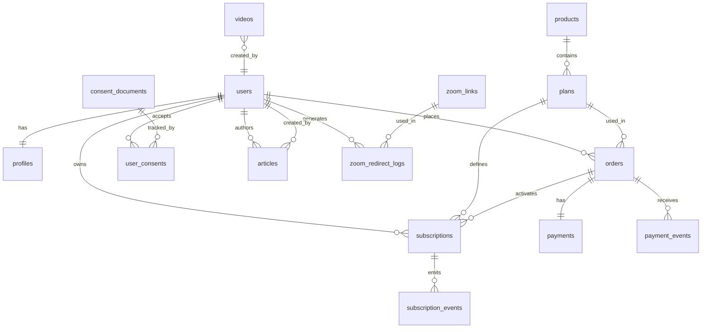

# 02. Domain Model и ERD (MVP)

## 1) Принципы модели

- Источник правды по доступу: `subscriptions` (не фронтенд и не webhook payload).
- Платежные события неизменяемые: каждое входящее событие пишется в `payment_events`.
- Ручные действия операторов всегда аудируются в `audit_log`.
- Модель поддерживает ручное продление подписки как основной MVP-сценарий.

## 2) Сущности и поля

## `users`
- `id` (uuid, pk)
- `email` (citext, unique, required)
- `password_hash` (nullable для magic-link сценариев)
- `role` (`student | admin | editor | support`)
- `status` (`active | blocked | pending_verification`)
- `created_at`, `updated_at`, `last_login_at`

Жизненный цикл:
- `pending_verification` -> `active` -> (`blocked` по решению admin) -> `active`.

## `profiles`
- `user_id` (pk/fk -> users.id)
- `first_name`, `last_name`, `phone`, `telegram_handle`, `timezone`
- `medical_flags` (jsonb, только минимально необходимое)
- `created_at`, `updated_at`

## `products`
- `id` (uuid, pk)
- `code` (unique; пример: `yoga-club`)
- `name`, `description`
- `type` (`subscription | one_time`)
- `is_active`
- `created_at`, `updated_at`

## `plans`
- `id` (uuid, pk)
- `product_id` (fk -> products.id)
- `code` (`club-month`, `club-year`)
- `billing_period` (`month | year`)
- `price_rub` (integer, в копейках)
- `currency` (`RUB`)
- `duration_days`
- `is_active`
- `created_at`, `updated_at`

## `orders`
- `id` (uuid, pk)
- `user_id` (fk -> users.id)
- `plan_id` (fk -> plans.id)
- `status` (`created | pending_payment | paid | failed | canceled | manual_review`)
- `amount_rub` (integer, копейки)
- `payment_provider` (`prodamus`)
- `provider_order_id` (nullable)
- `idempotency_key` (unique)
- `created_at`, `updated_at`

Жизненный цикл:
- `created -> pending_payment -> paid`
- альтернативно: `pending_payment -> failed | canceled | manual_review`.

## `payments`
- `id` (uuid, pk)
- `order_id` (fk -> orders.id, unique для MVP)
- `provider` (`prodamus`)
- `provider_payment_id` (unique)
- `status` (`processing | succeeded | failed | refunded | chargeback`)
- `amount_rub`
- `paid_at` (nullable)
- `raw_payload` (jsonb)
- `created_at`, `updated_at`

## `payment_events`
- `id` (uuid, pk)
- `provider` (`prodamus`)
- `provider_event_id` (nullable; если нет, используем hash payload)
- `provider_payment_id`
- `event_type`
- `event_status`
- `signature_valid` (bool)
- `dedup_key` (unique)
- `payload` (jsonb)
- `processed_at` (nullable)
- `created_at`

Назначение:
- Журнал входящих webhook и защита от повторной обработки.

## `subscriptions`
- `id` (uuid, pk)
- `user_id` (fk -> users.id)
- `plan_id` (fk -> plans.id)
- `source_order_id` (fk -> orders.id)
- `status` (`active | grace | expired | suspended | canceled`)
- `starts_at`, `ends_at`
- `grace_ends_at` (nullable, правило MVP: `ends_at + 72h`)
- `auto_renew` (bool, всегда `false` для MVP)
- `renewal_mode` (`manual`)
- `canceled_reason` (nullable)
- `created_at`, `updated_at`

Жизненный цикл:
- `active -> grace (72h) -> expired`
- `active -> suspended -> active`
- `active -> canceled`.

## `subscription_events`
- `id` (uuid, pk)
- `subscription_id` (fk -> subscriptions.id)
- `event_type` (`activated | renewed | suspended | restored | expired | canceled`)
- `actor_type` (`system | admin | support`)
- `actor_user_id` (nullable)
- `reason` (nullable)
- `metadata` (jsonb)
- `created_at`

## `consent_documents`
- `id` (uuid, pk)
- `doc_type` (`offer | privacy | refund | medical_disclaimer | cookies`)
- `version` (semver/string)
- `effective_from`
- `content_hash`
- `is_active`
- `published_at`

## `user_consents`
- `id` (uuid, pk)
- `user_id` (fk -> users.id)
- `consent_document_id` (fk -> consent_documents.id)
- `accepted_at`
- `source` (`checkout | register | profile_update`)
- `ip` (inet)
- `user_agent`

## `videos`
- `id` (uuid, pk)
- `kinescope_video_id` (unique)
- `title`, `description`
- `category` (`practice | seminar | intro`)
- `access_level` (`club_active | public`)
- `is_published`
- `published_at`
- `created_by` (fk -> users.id)
- `created_at`, `updated_at`

## `articles`
- `id` (uuid, pk)
- `slug` (unique)
- `title`, `excerpt`, `content_markdown`
- `visibility` (`public | club_only`)
- `seo_title`, `seo_description`
- `status` (`draft | published | archived`)
- `published_at`
- `created_by`, `updated_by` (fk -> users.id)
- `created_at`, `updated_at`

## `zoom_links`
- `id` (uuid, pk)
- `name`
- `target_url` (encrypted at rest)
- `status` (`active | inactive | rotating`)
- `last_rotated_at`
- `created_at`, `updated_at`

## `zoom_redirect_logs`
- `id` (uuid, pk)
- `user_id` (fk -> users.id)
- `zoom_link_id` (fk -> zoom_links.id)
- `result` (`allowed | denied`)
- `reason` (`subscription_inactive | role_denied | link_inactive | ok`)
- `ip`, `user_agent`
- `created_at`

## `idempotency_keys`
- `key` (pk)
- `scope` (`checkout | admin_action | webhook_internal`)
- `request_hash`
- `response_code`
- `response_body` (jsonb)
- `expires_at`
- `created_at`

## `audit_log`
- `id` (uuid, pk)
- `actor_user_id` (nullable)
- `actor_role`
- `action`
- `entity_type`
- `entity_id`
- `before_state` (jsonb)
- `after_state` (jsonb)
- `ip`, `user_agent`
- `created_at`

## 3) ERD (MVP)

## 4) Ключевые бизнес-ограничения

1. Одновременно активна только одна подписка типа `yoga-club` на пользователя.
2. `payments.provider_payment_id` уникален глобально (защита от дублей).
3. Любой `webhook` сначала пишется в `payment_events`, затем обрабатывается в бизнес-логику.
4. Выдача доступа в Kinescope/Zoom разрешена только если `subscriptions.status = active` или `grace` (в пределах 72 часов после `ends_at`).
5. Любое ручное изменение подписки/Zoom-ссылки создает запись в `audit_log`.

## 5) Индексы (минимально необходимые)

- `users(email)`
- `orders(user_id, created_at desc)`
- `orders(provider_order_id)`
- `payments(provider_payment_id)`
- `payment_events(dedup_key)`
- `subscriptions(user_id, status, ends_at)`
- `articles(slug, status, visibility)`
- `videos(kinescope_video_id, is_published)`
- `zoom_redirect_logs(user_id, created_at desc)`
- `audit_log(entity_type, entity_id, created_at desc)`
